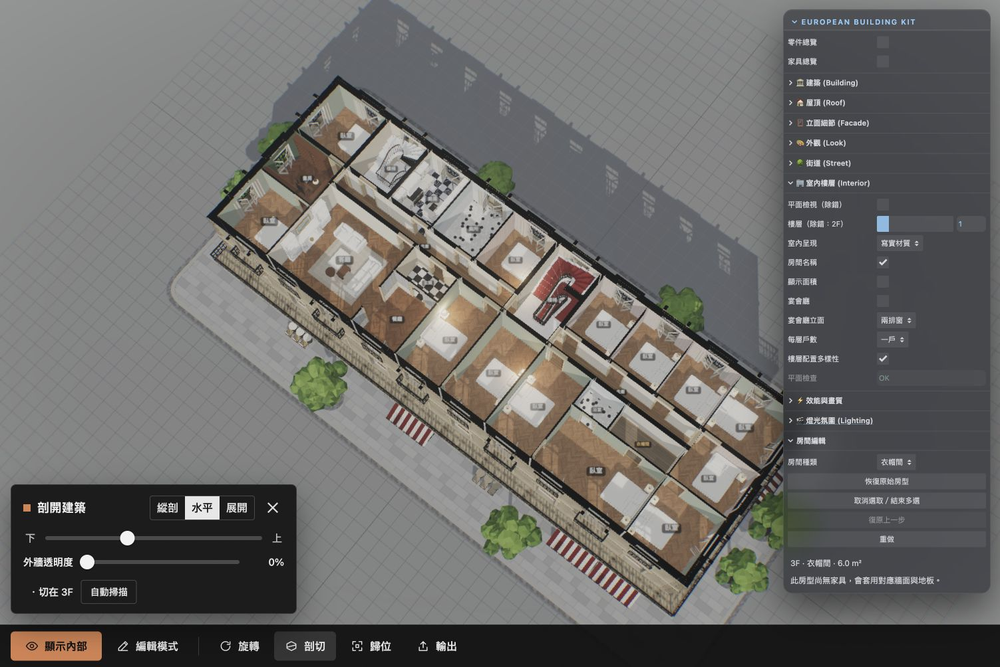

# 20 上限 P2：執行與交接

日期：2026-10-07。狀態：P2 完成；P3–P8 尚未實作，GUI 上限仍為 10／8／6。

依據：[20上限實作計畫.md](20上限實作計畫.md) 的 P2。執行建議：GPT-6.1 Sol / high。

## 1. 開關與相容性

室內資料夾新增「樓層配置多樣性」，對應 `BuildingParams.floorVariety`。未填或 false 完整走既有路徑；`defaultParams()` 保持原狀，11 組完整平面雜湊與 P0 基線一致，明填 false 與未填的平面完全一致。尺寸版本、layoutMode、立面、固定格子、核心與走廊仍使用 P1 結構。

開關隨每棟參數保存；切回舊參數沒有此欄位時，明確恢復 false。新增建築繼承目前的基本參數，多樣性開／關各棟獨立。未放大 GUI，未加入中庭、採光井、多核心、電梯或新版高層逃生功能。

## 2. V1–V5

- **V1 客廳位置**：臨街相鄰兩格均列為候選，不只選中央；保留既有種子 1 的書房轉角規則，其他種子一般層不重新鎖回轉角。少於五格或雙格候選不足以留下臥室／廚房採光位置時，用一格。
- **V2 廚房側**：獨立抽主／服務核心的左右側，有可用內側帶才使用該側；廁所優先放在另一側的無窗空間，再嘗試另一側內側帶，無合法候選時保留可行選擇。
- **V3 接待室合併**：30% 獨立抽樣，選客廳＋餐廳或增加相鄰臥室成三開間客廳；需為矩形且不超過三個標準開間，保留必要臥室。
- **V4 主臥合併**：30% 獨立抽樣，只合併同戶、同排、相鄰臥室；五間以上的住戶合併後仍至少兩間臥室。
- **V5 套房**：30% 獨立抽樣，候選為合併主臥或深度至少 5 m 的臥室，從實際走廊端切出 1.8 m 深服務帶，浴室及衣帽間各開門到臥室。兩間服務房及剩餘臥室都放得下才採用；所有外窗保留給臥室，不硬切狹窄單開間。
- **V5 玄關**：30% 獨立抽樣，在接待室的實際走廊入口端切 1.8 m 深玄關；只連原接待室與該走廊。
- **V5 備餐室**：30% 獨立抽樣，廚房和餐廳不相鄰、且有同戶介於兩者間的空間才生成。先嘗試不佔窗的內部細帶；否則使用符合尺寸的無窗儲藏間，只連廚房與餐廳。沒有實際橋接空間時不生成，不穿走廊或別戶。

新增切線兩端必須嚴格位於外牆內側輪廓內，新增隔牆為 0.1 m partition；既有走廊／樓梯邊界保留 spine／cage。浴室、衣帽間、玄關、備餐室淨寬至少 1.5 m、淨面積至少 3 m²；臥室保留最小淨尺寸 2.6 m。尺寸、機率、上限集中於 `interior.variety`，未改零件形狀或重烘 AO。

## 3. 簽章與重抽

`planning/signature.ts` 比較固定 cell ID 內的實際子矩形、用途、合併群組與戶別。排除樓層／房間 ID、樓高、種子、原始 apartment 編號；戶及群組按格子／細分幾何正規化，完全遮罩的房間不影響其他群組編號。

由下往上比較實際相鄰樓層；一樓、有宴會廳的二樓、閣樓豁免，不跨豁免層比較。3F 挑空與 4F 比較時，兩邊都遮罩宴會廳格子，不能靠孔洞差異湊多樣性。正面三開間以下允許重複。

每層首抽＋最多八次重抽。每個用途使用獨立 PURPOSE，包含 seed／level／apartment／retry；改外觀或窗扇角度不重排。候選使用全新可變 Unit／門窗，固定拓撲不變。初版為確保樓梯與跨層窗戶參照一致，重抽時重新組裝整份純資料平面；其他樓層的抽樣鍵不變，按層快取優化留待 P7。

`programDiagnostics` 與 `issues` 分開，逐層記錄 exempt／varied／repeated／legacy-fallback、重抽次數、V1–V5 選擇、`generatedSignature` 及拒絕原因。`generatedSignature` 描述編輯前生成結果。合法但八次仍相同者標 repeated；幾何不合法且重抽用完才退回該層 legacy，保留拒絕原因。最終仍執行檢查，不把幾何錯誤改成可接受重複。

## 4. 房型、編輯與呈現

新增 `bathroom` 浴室、`closet` 衣帽間、`foyer` 玄關、`pantry` 備餐室；繁中名稱、提案圖解色、寫實牆面／地板、既有窗後圖集規則均接入，不增加外部資產。浴室編輯到有窗房間時沿用廁所的隱私窗簾規則。

生成的私用房間只對明列目標開門，不能變成通行檢查的圖根。平面檢查增加正面積、真實輪廓重疊、採光窗、私用入口、服務空間淨尺寸／面積；凹形房間以三角形交集檢查，不因外接矩形重疊而誤報。

四種新房型可改名、復原／重做、合併及重套。cellIds、私用入口和 diagnostics 在編輯副本獨立保存；合併後更新其他房間的門目標，合併出的新房間不沿用舊服務房的用途限制。新房型尚無專屬家具，GUI 正確提示並顯示材質；原臥室、客廳等家具仍依切分後實際輪廓配置。

## 5. 驗證結果

原始報告：[P2配置驗證.json](P2配置驗證.json)。

- 舊配置：11 組完整平面基線；三種戶數各 8,640 組，合計 25,920 組，零 issues。
- 開啟多樣性：同一完整矩陣＋28 組指定／呈現案例，共 25,948 組、136,266 層，零 issues、零 legacy-fallback。合計重抽 5,583 次，單層最多 8 次；330 層接受合法重複並記 diagnostics，包含臨街選擇很少的 7×2 等小平面，沒有隱藏成未標記的不同配置。
- 指定預設種子 1–10：3F／4F 在宴會廳格子以外全部不同，沒有 repeated 或 fallback；一樓、宴會廳二樓、閣樓與原配置相同，核心／走廊輪廓不改。
- 驗證生成的 21,734 個玄關、97 個備餐室；另加入 seed 7、10×3、6 上層、一戶、無宴會廳案例，生成一對浴室／衣帽間。97 個備餐室含完整矩陣的 96 個及一個指定重現案例。
- 簽章 ID／高度／戶別重編號／順序／遮罩反例、細分改變、合法與非法套房／備餐橋接、窗戶唯一歸屬、雙向門參照、外牆端點、新房型材質與編輯／復原／重套通過。
- `check:rooms`：1,059 次合併、512 個非矩形輪廓，以及選取／觸控回歸通過。
- `check:unfold`：10 種配置、4,287 個保留標籤，包含多樣性、套房及其寫實家具；裁切、材質、燈光、點選、收合與釋放通過。
- `check:buildings`、`check:facade`、`npx tsc --noEmit -p .`、`npm run build` 通過；build 仍有既有大型 bundle 提醒。
- Browser 技能在 Chrome 的本機 5177 驗證多樣性開關、平面／水平剖切、實際衣帽間點選、四種新選項、改成儲藏間／復原、兩棟開關繼承與分別恢復；無 console error。未做手機及 FPS／GPU 驗收。使用者 5176 未關閉。

純平面 CPU（Node SSR，暖機 5 次／取樣 30 次，含簽章、重抽及 checker，不含生成、mesh、家具、標籤、GPU）：預設 p50 0.912 ms／p95 1.322 ms；10×8×6 p50 7.193 ms／p95 8.361 ms。這不是整棟重建達標證明，P1 的家具／標籤成本仍須 P7 解決。

```sh
npm run check:plans
npm run check:variety
npm run check:variety -- --matrix --json Guide/room-planning_v2/P2配置驗證.json
npm run check:rooms
npm run check:unfold
npm run check:buildings
npm run check:facade
npx tsc --noEmit -p .
npm run build
```



下一階段 **P3 多核心與高層動線**：依原計畫建議 **GPT-6 Astra / xhigh**。完成本階段本機 commit，不推送。
