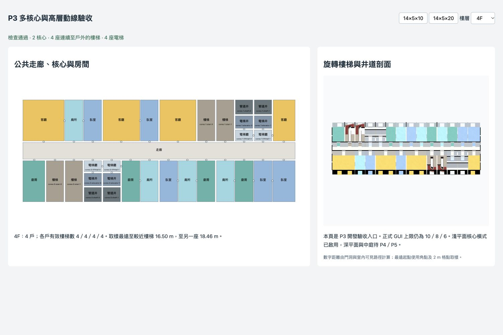

# 20 上限 P3：執行與交接

日期：2026-10-07。狀態：P3 完成；P4–P8 尚未實作，GUI 上限仍為 10／8／6。依據 [20上限實作計畫.md](20上限實作計畫.md) 的 P3，建議執行 GPT-6 Astra / xhigh。

## 1. 入口與範圍

舊版 `layoutMode` 未填／legacy，以及 auto 的原 10×8×6 範圍，繼續保留既有算法及輸出。10×8×6 即使室內深度超過 20 m 也保留舊結構，不能將 P3 深度門檻套回這條相容路徑。

超出舊範圍的 auto 新增 `topology.mode="cores"` 候選：至少八欄、室內淨深 ≤20 m，兩帶樓梯真實深度及窗間壁／公共走廊均可行。盲背街角優先背帶；核心前帶容量不足可試背帶。正常深平面候選仍回傳 unsupported，等 P4/P5；窄／過淺或住宅採光容量不足回傳 infeasible + core-capacity，不默默改 legacy。2×2×20、2×20×20、20×2×20 皆得到預先定義的具體原因。

新路徑在 `planning/cores.ts` 預留核心與公共走廊，`corePlan.ts` 只對住宅可用格 program／合併／細分。每個核心獨立解 one／two，`circulation.apartmentCounts` 保存逐層要求／實際戶數及理由；容量不足退一戶，地面店面／入口優先，剩餘不能構成完整戶則記為非住宅服務空間。宴會廳只限制自己的服務區為一戶。

## 2. 核心、動線及幾何

- 7–14 上層：每戶至少兩個不同有效 stairId，各核心一座電梯。15–20 上層：每核心雙梯／雙電梯。14×5×10 實際是兩核心、兩梯、兩電梯；14×5×20 是兩核心、四梯、四電梯。
- 每座必要梯從 1F 到閣樓，服務範圍、各層房間／平台門、每段梯的起訖高度、踏步及地面戶外出口均由資料重新查驗。只有 1F→2F 的禮儀梯、同 ID 的重複梯、斷掉的中間梯段不能當第二梯。
- PlanStair.kind 只表示造型；另有 id、coreId、frame、landingEdge、from/to。有 frame 時 layout.rect 是局部座標，polygon 是世界座標。梯段／欄杆／地毯等局部造型轉回世界框架；門洞驗證使用同一平台邊。前／背核心有實際 180° 旋轉，90°／180°／−90° 整份平面旋轉後的門圖與出口驗證亦通過。
- 門圖用實際雙側門洞與多邊形可見路徑加權；公共路徑不能穿別戶、店面、電梯井或管道井。無窗設備房不當住宅採光格；所有外牆開口唯一歸屬，設備開口另有 maintenance 語意。
- 距離量測至同層有效梯平台，不含下樓總長。最遠起點使用角點及 2 m 格點，點對點可見路徑不穿凹輪廓外；屬取樣值，未證明全域最大值、未含家具或人體半徑。一般限 50 m，高層至兩個不同梯都限 45 m，為可調生成規則，非地區法規認證。
- 新 liftHall／elevator／shaft 接入房名、圖解、寫實材質及窗後圖集；不得更換房型或合併。電梯門只用 wall.openings.role=equipment 渲染，沒有住戶 PlanDoor；合併重建門參照也排除它。
- 井道各層對齊，樓板及天花有真實孔洞，井壁跨樓板厚度連續，設備房不鋪家具／一般地板飾面。井在閣樓屋面內封頂，不是通天井；頂層 ceiling=false 表示頂封。中庭／採光井的屋頂通天空洞仍屬 P4/P5，P3 保留原孟莎屋頂。
- 主要門檻與尺寸集中在 blender/kit_dims.json 的 interior.planning.cores；未改 kit 零件形狀，未跑 Blender／AO 重建。

## 3. 驗證結果

原始結果：[P3核心驗證.json](P3核心驗證.json)。

| 檢查 | 結果 |
|---|---|
| 既有完整平面基準 | 11 組完整 SHA-256 與 P0 一致 |
| 舊生成矩陣 | auto／two／one 各 8,640，合計 25,920，零 failures |
| P3 指定矩陣 | 108 可行＋3 窄基地明確不可行，共 111；包含 6／7／14／15／20 上層、三建築類型、兩轉角、三戶數模式、兩樓高及三地面用途 |
| 14×5×10 種子 1–10 | V1–V5 開啟；各案至少三個可比較中間樓層，相鄰有效簽章均不同，無非法退回 |
| 反例 | 11 組，包括凹輪廓抄近路、禮儀梯、同梯 ID、電梯取代雙梯、核心缺電梯、缺戶外門、穿越別戶、斷梯、平台移位、井道漂移、不對稱門 |
| 旋轉幾何 | 四方向，共 240,024 個頂點；局部幾何均落在對應世界梯間，完整平面另驗三種旋轉 |
| 井道幾何 | 真實 ray 測試證明中間層電梯中心的樓板與天花為孔洞 |
| 編輯 | 新配置改房型、復原、實際合併、重套通過；核心／孔洞不變，設備門不變成步行門 |
| P2 代表回歸 | 296 案、1,591 層，零非法退回；既有套房／備餐室／簽章及私用門檢查通過 |
| 房間編輯回歸 | 1,059 次合併，512 凹輪廓；滑鼠／觸控 callbacks 通過 |
| 展開回歸 | 12 配置，7,716 個標籤；裁切、材質、燈光、選取、資源釋放通過 |
| 多棟／透明度 | check:buildings、check:facade 通過 |
| 編譯／建置 | tsc + vite build 通過；沿用既有 >500 kB chunk 提示 |

## 4. 性能與瀏覽器

Node SSR，3 次暖機＋10 樣本，量測純平面，含 program、簽章／重抽、幾何與加權路徑 checker：14×5×10 p50 50.295 ms／p95 51.040 ms；14×5×20 p50 273.119 ms／p95 288.734 ms。排除 topology／外牆生成、3D meshes、家具、標籤與 GPU；不代表整棟已達 P7 性能門檻。

沿用 [Browser 技能](/Users/ken.chen/.codex/plugins/cache/openai-bundled/browser/26.930.31730/skills/control-in-app-browser/SKILL.md)，在 5177 的 `/dev/cores.html` 實際檢視 10／20 上層、1F 入口及中間層平面、旋轉梯／井道剖面。20 上層中間層四戶皆可到四座有效梯；畫面無 error／warn。未操作或關閉使用者的 5176。這是開發驗收頁，不在正式 GUI 公開。



## 5. 重現與下一階段

```sh
npm run check:cores -- --json /private/tmp/p3-cores.json
npm run check:plans
npm run check:topology
npm run check:variety
npm run check:rooms
npm run check:unfold
npm run check:buildings
npm run check:facade
npm run build
```

下一階段 **P4 深平面＋採光井，GPT-6 Astra / xhigh**。接著處理組數／井列試排、真正井窗、深平面公共核心連通及樓板／屋頂洞；可重用 CorePart 的局部框架、public/equipment 語意及門圖。P5 再做中庭 O/U；P6 完成戶型與垂直分段，P7 性能與產品整合，P8 才開放三上限到 20。
