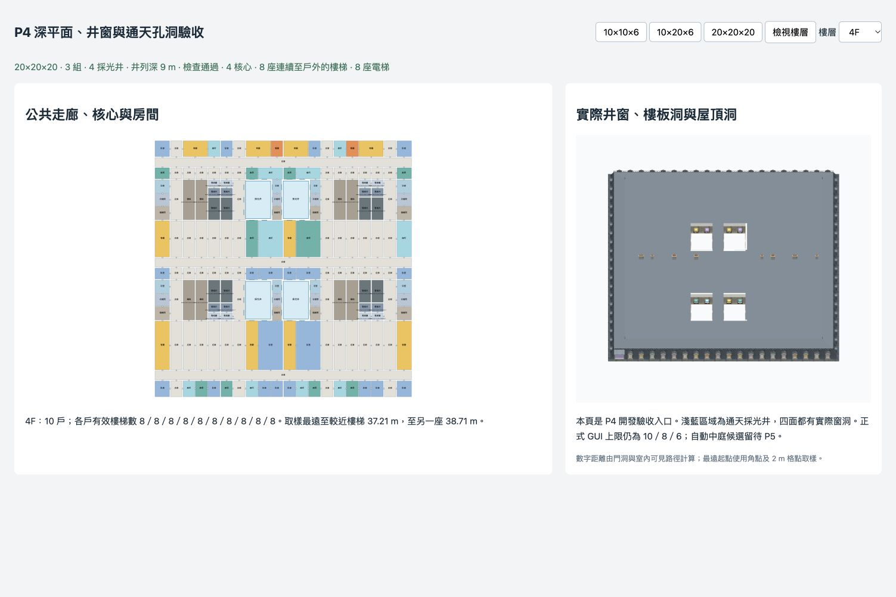

# P4 深平面與採光井執行紀錄

日期：2026-10-07。P4 已完成；正式 GUI 仍為正面 10／側面 8／上層 6。新增功能以 `layoutMode: "lightwell"` 及開發驗收頁使用；自動 O／U／採光井候選順序留在 P5，不會改變舊範圍的 auto。

## 實作結果

`planning/deep.ts` 在立面與用途生成前解算組數、3 m 格線對齊的井列、公共橫廊／縱向連通及實際核心。組數公式只作初估，重新核對房間帶、井牆厚度、梯段、電梯及公共連通的空間；不成立時試較少組數，沒有合法候選則回報原因。必要核心與連通欄先扣除，井與核心之間保留服務欄，井不侵占梯間淨尺寸。

井深為 `ceil(max(3, 0.1 × wallTop)/3) × 3`；20 上層牆頂 68.4 m，井列採 9 m，井寬增為 6 m。低層井寬／深均 3 m。首版公共廊寬 2.4 m，井列間房間帶依窗間壁試排，最短結構帶為 2.9 m 左右，扣除隔間後臥室淨尺寸仍 ≥2.6 m；不是把提案的 4.4 m 名義房間帶當固定值。尺寸來源只有 `blender/kit_dims.json`。

住宅格先依實際可用採光面作結構分割，盲窗間部分與相鄰採光格合為完整矩形房間；不在 `program` 後將盲住宅改名儲藏室。井列的浴室、衣帽間與儲藏，以及連棟盲側端欄，另在結構階段標為服務空間，面積獨立報告；直接接公共廊的為共享服務，其餘整個連通服務群歸入一個鄰接住戶，禁止共用空間經住戶通行。每層在用途分配前，以實際生成開口重新計算 `daylightDiagnostics`；住宅可用格無窗比例超過 10% 會報 issue。指定案例均為 0%。分戶沿用 P3 的完整住宅容量檢查，按「組＋核心服務區」記要求／實際戶數；完整 A/B/C 模板與 D1–D3 仍在 P6。

每組公共廊以各段矩形生成，沒有把多條廊及井包成一個矩形。兩端及高層核心旁設公共縱向連通；端欄到公共廊最多穿過一間同戶房間。高層保留真正平台門、連續梯段與一樓戶外出口，沿用 P3 的加權門洞／多邊形可見路徑檢查。

## 井窗與幾何

每口井有四個順時針內側立面，重排現有 G／N／S／A 窗模組，閣樓採垂直 S 窗立面與屋頂收邊；不需修改 Blender 零件或重烘 AO。實際井窗、窗框／窗扇／百葉及欄杆均生成，內襯依 kit manifest 的真實窗洞挖孔。井壁穿越樓板厚度，延伸至各屋面高度；各層樓板、天花及閣樓天花均保留井洞。

`roofCap` 按各屋面三角片裁去孔洞，保留高度／UV 插值；即使孔洞跨過 terrasson 與平頂的接縫，也不會被三角形覆蓋。煙囪避開井口。

外側 `side`／`windowKey` 保留原值。內側使用含井位置的 `facadeId`／opening key，並提供 `buildingFacade` 統一查詢。井的尺寸或位置消失時，舊設定保留於參數但不會套到其他井。井窗編輯提供窗扇、百葉、窗簾及一樓窗型；內側固定欄杆與垂直閣樓窗，避免將外側陽台／老虎窗選項套入井。窗後圖集、房間編輯來源鍵、平面圖及露台查詢均接入新識別；編輯／合併／復原保留孔洞及核心資料。

深平面首版不配置宴會廳挑空；若輸入要求 ballroom，拓撲 diagnostics 會明記。正背面保留店面配置，側面一樓採一般窗以容納井列服務分割；舊模式的店面及宴會廳不變。

## 驗證

完整資料：[P4採光井驗證.json](P4採光井驗證.json)。36 個可行案例包含三個指定尺寸各 seeds 1–10、斜切角、uniform 樓高、兩個 V1–V5 開啟案例及連棟盲側。另驗證窄基地的預定不可行回應、房間侵入井的反例、井窗 key 重複、共用服務空間不得經住宅通行、結構無窗比例不可用改名掩蓋、跨屋面接縫裁洞、井窗設定與消失設定停用。

| 指定場景 | 組數 | 井列深 | 井數 | 核心／樓梯／電梯 |
|---|---:|---:|---:|---|
| freestanding 10×10×6 | 2 | 3 m | 2 | 1／1／0 |
| freestanding 10×20×6 | 4（兩個內部組） | 3 m | 6 | 3／3／0 |
| freestanding 20×20×20 | 3 | 9 m | 4 | 4／8／8 |

上表的層數為上層，不含一樓與閣樓。指定三場景各逐層驗證全體公共空間連通、唯一窗戶歸屬、住宅用途／尺寸、各井及設備井垂直對齊。井中心與四角內側共 60 條向下射線穿過屋頂、閣樓及所有樓板而不遇封閉面；144 條窗中心射線確認四面井窗在一樓、上層及閣樓內襯都是真實孔洞。屋頂所有三角形另作井區相交面積檢查。

舊版 11 組完整雜湊、25,920 組平面矩陣、8,640 組拓撲及 9,037 個鄰接案例通過。P3 核心 111 組及 11 個反例、P2 296 組代表案例、1,059 次房間合併、多棟及透明度回歸均通過。展開涵蓋 14 種配置，新增深平面及高層井；10×10×6 整棟實際家具頂點也驗證不進入井。TypeScript／production build 通過；原有大 bundle 提示仍存在。

沿用 [Browser 技能](/Users/ken.chen/.codex/plugins/cache/openai-bundled/browser/26.930.31730/skills/control-in-app-browser/SKILL.md)，在 5177 的 `/dev/deep.html` 實看三個指定場景的平面、井窗、樓板洞及高層屋頂井口，未操作使用者的 5176。



## 範圍與後續

此階段完成明確指定的採光井候選，不保證所有 2–20 開間組合都有井解。缺乏住宅採光／核心容量的候選回報不可行；街角盲背的其他候選，以及 auto 的 O／允許 U／井候選順序，在 P5 處理。P6 再做完整戶型、垂直分段與深平面多樣性；P7 驗證及優化整棟 CPU／GPU 性能；P8 才公開三個 GUI 上限至 20。

動線距離仍為 P3 的同層室內點到平台取樣，未加入下樓總長、家具與人身半徑；不是地區法規認證。P4 未聲稱通過大型整棟性能目標。

```sh
npm run check:deep -- --json /private/tmp/p4-deep.json
npm run check:plans
npm run check:topology
npm run check:cores
npm run check:variety
npm run check:rooms
npm run check:unfold
npm run check:buildings
npm run check:facade
npm run build
```

下一階段 **P5 中庭 O／U 與入口，GPT-6 Astra / xhigh**。依逐階段規則，切換後再開始。
