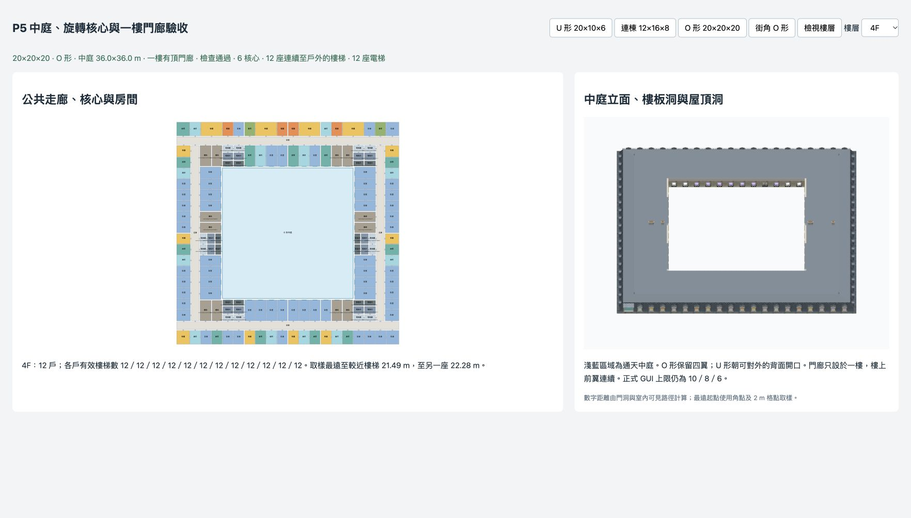
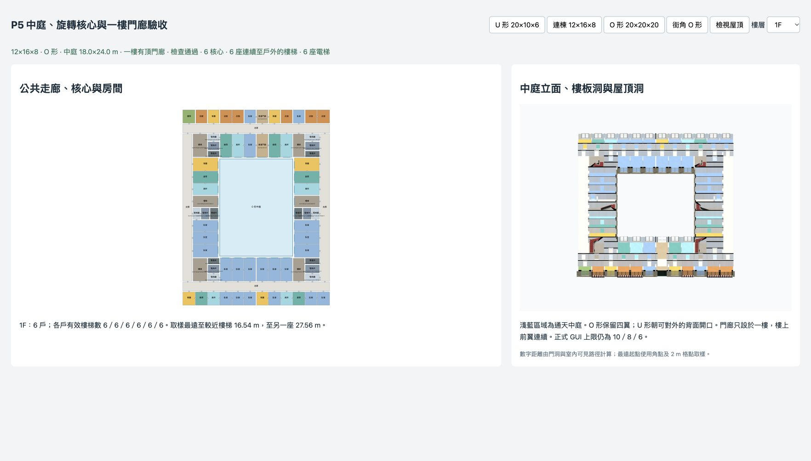

# P5 中庭 O／U 與入口執行紀錄

日期：2026-10-08。分支：`feature/room-editor`；前階段提交：`b8d7eef`。P5 已完成，正式 GUI 維持正面 10／側面 8／上層 6；20 上限正式開放仍待 P8。

## 完成內容

`planning/courtyard.ts` 在用途生成前決定中庭、各翼、旋轉核心、公共廊與服務區。中庭短邊至少 `max(6 m, 0.5 × wallTop)`，對齊開間；盲翼住宅朝中庭，窄末端格先合併，服務面積另列。核心沿用 P3 的尺寸、平台、設備井及梯／電梯規則，並驗證完整住宅容量。

大型深平面 auto 依 O→可行 U→採光井試排，保留各候選失敗原因。舊範圍 auto 保持 legacy；explicit courtyard 不改成井，explicit lightwell 不被中庭取代。O 四翼圍合；U 採真正凹形外輪廓，目前只向非盲牆背面開口，街角盲背不得打開。其他 U 方向與 L 形不在本階段。

一樓正面一開間門廊連接街道、公共廊及中庭，公共內部通口使用既有 2.2×2.7 m ground door 尺寸，上層前翼完整。新增 `porch` 公共房型、材質及編輯保護。中庭門不作街道出口，真實門洞及旋轉平台接入加權通行圖。正面及 O 背面保留店面；側面與 U 背翼端部採一般窗。中庭宴會廳挑空尚未提供，要求時明記 diagnostics。

內庭立面沿開間格線放真實門窗，內襯依 opening profile 裁孔；內側 ID 包含形狀／位置，失效的窗設定停用。外侧 bay key 不重新編號，U 移除處標 absent。編輯、合併、復原保留中庭及核心資料。

O 樓板／天花使用中庭洞，U 使用凹輪廓；屋頂共用外側 `roofEnvelope` 並裁除通天區。內庭垂直牆按屋面折線補齊端條、閣樓上方封邊與壓頂；避免其他翼的屋面平面壓低閣樓。U 背面內襯與老虎窗按實際邊界裁切，低屋面處省略放不下的窗。煙囪與家具避開中庭。沿用原 kit，沒有修改 GLB、manifest 或 AO。

## 驗收結果

| 檢查 | 結果 |
|---|---|
| `check:courtyard` | 130 組：四個主要配置 × seeds 1–10 × auto／one／two，加十個高層、用途、斜切、風格及多樣性案例；全部通過 |
| 幾何與負向檢查 | 445 通天射線、456 內庭開口射線；屋面不覆中庭、上層覆蓋門廊、家具不進中庭；窄基地、盲背 U、侵入中庭、孔洞漂移、偽出口、私有門廊及斷開平台均能被拒絕 |
| 最後精簡矩陣 | 14 組通過，含最終邊界／立面 ID 數量一致性 |
| `check:plans` | 舊 25,920 組矩陣通過；11 組結構及完整平面雜湊與 `99b2871` 相同，收尾再驗亦相同 |
| `check:deep`／`check:cores` | 36 井案例；111 核心案例、11 基線、11 反例、240,024 個旋轉頂點通過 |
| `check:topology` | 8,640 舊外輪廓、9,037 鄰接比對通過 |
| `check:rooms`／`check:unfold` | 1,059 合併、512 非矩形輪廓；16 配置、19,452 標籤及真實家具／裁切／清理通過 |
| `check:variety` | 296 配置、1,591 層，72 次重抽、5 次合法重複、零非法退回 |
| `check:buildings`／`check:facade` | 多棟隔離、透明度回歸通過 |
| `npm run build` | TypeScript 與 Vite 通過；仍有原有大於 500 kB bundle 提示，性能由 P7 處理 |

完整中庭資料：[P5中庭驗證.json](P5中庭驗證.json)。重現入口：

```sh
npm run check:courtyard -- --json Guide/room-planning_v2/P5中庭驗證.json
npm run check:courtyard -- --quick
npm run check:plans
npm run check:deep
npm run check:cores
npm run check:topology
npm run check:rooms
npm run check:unfold
npm run check:variety
npm run check:buildings
npm run check:facade
npm run build
```

## 瀏覽器驗收

使用 Browser 技能操作 5177 `/dev/courtyard.html`，實看高層 O、背開口 U 屋頂與連棟一樓門廊。20×20×20 的中庭 36×36 m，6 核心／12 梯／12 電梯；4F 有 12 戶，取樣最遠至較近梯 21.49 m、至另一梯 22.28 m。連棟 12×16×8 中庭 18×24 m，1F 門廊保留，6 核心／6 梯／6 電梯。





此頁是驗收預覽，未在正式 GUI 開放新模式。房間編輯／復原本階段由 CLI 驗證。距離沿用 P3 的同層角點及 2 m 格點取樣，未包含下樓垂直總長；不是地區法規認證。未重新量測完整高層 CPU／GPU 性能。

## 下一階段

P6 戶型與垂直分段：L4、V6、D1–D3、W1–W4，建議 **GPT-6.1 Sol / high**；跨翼難題再用 Astra / xhigh。P7 處理性能，P8 才整合正式介面與開放 20 上限。本次只提交 P5，不推送，工作目錄原有文件搬移／刪除及使用者設定保留。
