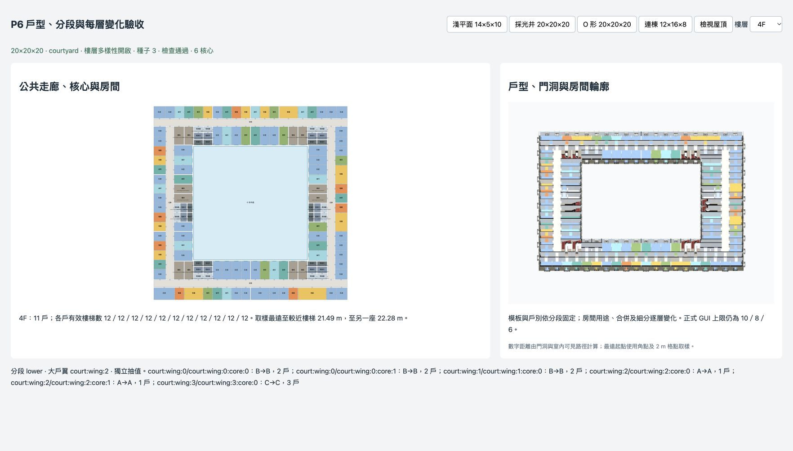

# P6 戶型與垂直分段執行紀錄

日期：2026-10-08。分支：`feature/room-editor`；前階段提交：`ca55be2`。P6 已完成。正式 GUI 仍為正面 10／側面 8／上層 6，20 上限在 P8 開放。

## 分段、模板與容量

新增 `planning/templates.ts`，接入共用核心、採光井及中庭配置的 `floorVariety` 路徑。舊 legacy 沿用 P2；關閉多樣性保持原輸出。分段決策不使用每層重抽次數，個別外觀參數不參與分戶。

20 上層採 1F 基座、2F 主樓層、3–11F 中段下、12–20F 中段上、21F 頂層與閣樓。較少上層按比例縮短中段；≤6 沿用既有 G／N／S／A／R 分段。未加入設備層、退縮露台或新腰線，立面、樓層高度、核心及孔洞仍由既有共用結構控制。

A 試一戶，接待室至少兩個結構格且有書房，實際包含所屬服務房最多 12 間；B 試兩戶；C 試三戶，客廳一個結構格且不放書房。每戶均保留客廳、廚房、廁所、臥室及真實採光，分戶只沿既有 column 邊界。A／C 不成立退 B，B 不成立採完整緊湊一戶；無完整住宅容量時記原因。A 的房間數在實際編程後再核對，不符時整段退 B，避免同段有不同戶數。

`programStructure` 保存 segments、policies、逐層 templates 及跨組／翼 links。模板記 requested／resolved、合戶前 baseCount、合戶後 count、apartmentIds 及原因；跨翼合戶的戶號記在主服務區，另一服務區明記減戶。固定一戶／兩戶限制仍優先，並保留容量退回診斷。宴會廳挑空所在分段先以缺少挑空格的容量建立分戶，恢復樓板的樓層補回格子，挑空以外戶別保持一致。

## 深平面與中庭變化

- **D1**：每段每組抽 A／B／C，內部井組只 B／C；內部客廳優先井窗最多的格，不設書房。
- **D2**：每層抽浴室＋衣帽間、洗衣間＋儲藏、全儲藏。服務群歸屬依原格子及平台距離固定，不被合併後房間的中心改變。
- **D3**：每段最多一處，臨街戶併入內部供體的兩個井窗格；供體仍保留四個完整住宅採光格，經既有公共路徑連通，不佔用走廊。
- **W1**：每段選可試 A 的大戶翼，指定高層 O 場景各種子均有至少兩翼的實際 A 結果。
- **W2**：實際兩面外窗的轉角戶與鄰翼住戶合戶，外角房指定為客廳；保留各房輪廓，不以大矩形跨過核心或中庭。可沿既有公共廊連通，走廊保持公共；容量、雙面窗或連通不足時記退回原因。
- **W3**：每層選中庭側臥室或廚房／服務優先，盲翼不參加。
- **W4**：每段決定左右是否共用模板及房型抽值；既有核心、窗面與容量仍優先，不承諾改變原結構為幾何對稱。

V1–V5 仍逐層變化，最多重抽八次；重抽不改模板、格子戶別、跨組／翼合戶或公共動線。C 不作接待室合併，A 新增套房／玄關／備餐間之前預留 12 間上限。新增 `laundry` 洗衣間，接入繁中房名、圖解／寫實材質、窗後圖集、最小尺寸及編輯／復原；未新增洗衣家具。

## 房間輪廓修正

大型接待室／臥室合併後，同一邊可能包含厚公共牆及薄私用隔間。原整邊最大退縮會把薄牆門口吞掉；P6 逐牆段生成實際淨輪廓及台階，使門洞接到兩邊房間。保留隔間厚度，沒有放寬門圖斷言。核心、設備井及公共廊維持原固定輪廓；房間、家具、剖切及展開共用實際多邊形。

## 驗收

| 檢查 | 結果 |
|---|---|
| `check:templates` | 87 配置：7 指定場景 × seeds 1–10，加固定一戶／兩戶、宴會廳、街角斜切及 uniform；全部通過 |
| 生成內容 | A／B／C／compact 實際房型、必要房間、真實窗、A 房間數／書房／接待室、C 客廳與禁書房、相鄰簽章、分段格子歸屬、公共動線與孔洞均通過；零非法退回或未解釋重複 |
| 合戶政策 | 跨組供體保留完整住宅；跨翼有實際雙面窗客廳，公共廊及核心保持原幾何／歸屬；另以私有 L 形格子與斷開格子驗證接受／拒絕分支 |
| 編輯與確定性 | 洗衣間編輯／復原、分段資料深複製、相同輸入重現、拓撲不被程序改變通過 |
| `check:plans` | 舊 25,920 配置及 11 完整雜湊通過 |
| `check:cores`／`check:deep`／`check:courtyard -- --quick` | 111 核心案例／11 基線／11 反例／240,024 旋轉頂點；36 井案例；14 中庭幾何案例通過 |
| `check:rooms` | 1,059 合併、512 非矩形輪廓與互動 callback 通過 |
| `check:unfold` | 17 配置、23,715 房名標籤，含 P6 井／U／高層 O；真實家具不進井／中庭、裁切、材質、燈光、選取及清理通過 |
| `check:variety` | 舊 296 配置回歸通過 |
| `check:buildings`／`check:facade` | 多棟隔離與透明度回歸通過 |
| `npm run build` | TypeScript／Vite 通過；保留原有 >500 kB bundle 提示，整棟性能留 P7 |

本輪共 4,674 筆模板決策（A 1,166、B 1,846、C 638、compact 1,024），5 次樓層重抽；59 個樓層 D3 合戶、48 個樓層 W2 合戶成立，容量或連通不足的其餘候選有明確原因。

完整模板與合戶資料：[P6戶型驗證.json](P6戶型驗證.json)。可重現入口：

```sh
npm run check:templates -- --json Guide/room-planning_v2/P6戶型驗證.json
npm run check:templates -- --quick
npm run check:plans
npm run check:cores
npm run check:deep
npm run check:courtyard -- --quick
npm run check:rooms
npm run check:unfold
npm run check:variety
npm run check:buildings
npm run check:facade
npm run build
```

使用 Browser 技能在 5177 `/dev/templates.html` 實看種子 3 的高層 O 同層 A／B／C、4F／13F 下段／上段的大戶翼切換及房間／門洞。正式 GUI 未開新上限；實際距離仍按 P3 的同層角點／2 m 格點取樣，未包含垂直下樓，不作地區法規認證。完整 CPU／GPU 性能尚未重新驗收。



## 下一階段

P7 效能與現有功能整合，建議 **GPT-6.1 Sol / high**。以完整高層建築、家具、標籤、剖切／展開及分棟快取實測；P8 才開放正式 20 上限。本次只提交 P6，不推送；使用者原有文件搬移、刪除及設定變更保留。
