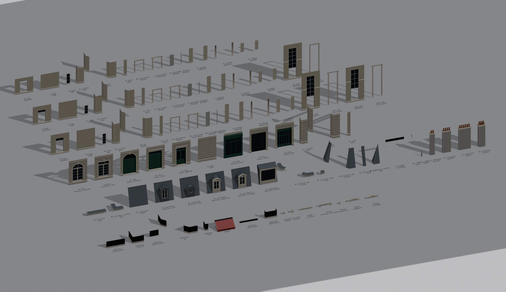

# blender/ — 歐式零件產線

全部零件由 Python 程序化產生，不手改 `.blend`。規格在 [KIT_SPEC.md](KIT_SPEC.md)，參考站研究在 [REFERENCE_NOTES.md](REFERENCE_NOTES.md)。

```bash
npm run kit   # 建模 → 預覽圖 → 匯出（需要 Blender 5.1+；換路徑用 BLENDER=... npm run kit）
npm run tex   # 烘焙 7 組自製貼圖與鐵花圖樣 → public/assets/tex/
npm run rooms # 建模並算出 16 間房間的室內圖集 → tex/interiors.jpg（約 1 分鐘）
npm run ao    # 烘焙全部零件的 AO（UV1）→ tex/kit_ao.jpg（約 10 分鐘，要先 npm run kit）
```

| 檔案 | 作用 |
|---|---|
| `kit_dims.json` | 尺寸常數，`build_kit.py` 和網頁端 `src/generator.ts`、`src/roof.ts` 共用。改尺寸只改這裡 |
| `build_kit.py` | 從空檔案建出 `european_kit.blend`：每個零件建好後檢查外框尺寸，不符就中止。加 `--ref` 會以連結方式載入參考站零件，只用來比對 |
| `kitlib/geom.py` | 幾何基本形：平面多邊形（可挖洞）、剖面沿路徑擠出（轉角斜接）、方塊、稜柱、桿件 |
| `kitlib/parts.py` | 剖面（腰線、簷口、陽台底板…）和共用構件（落地窗、欄杆、溝槽石材） |
| `kitlib/modules.py` | 開間、轉角、陽台、屋頂零件，每個零件一個函式，以及 `catalog()` 零件清單（含尺寸檢查條件） |
| `kitlib/ornaments.py` | 立面細節：窗套、窗楣與山花、托架、百葉、窗間壁裝飾、單窗陽台 |
| `kitlib/materials.py` | 材質佔位（網頁端依名稱重建材質） |
| `kitlib/blend.py` | 轉成 Blender 物件、尺寸檢查、UV1 打包 |
| `preview_kit.py` | 算出全部零件的預覽圖 `kit_preview.jpg` |
| `bake.py` | 貼圖產線：每組貼圖一個配方函式，用 Blender 節點（4D 環面座標餵雜訊，天生無縫）烘焙成 `<組>_color.jpg` 和 `<組>_rh.png`（粗糙度、高度）；鐵花用曲線畫，算成 `iron_lace.png`。節點材質另存 `textures.blend` 方便查看 |
| `rooms.py` | 室內圖集：16 間巴黎房間剖面用簡單幾何程序化建模，從窗前 16 m 算圖，拼成 2 × 8 格 |
| `bake_ao.py` | 用 Cycles 把全部零件的環境遮蔽烘進共用的 UV1 圖集 |
| `export_kit.py` | `KIT` 底下每個集合是一個插槽，每個子物件匯出成 `COL[集合][索引]` 節點；產生 `public/assets/kit.glb` 與 `kit_manifest.json` |

- 新增零件：在 `modules.py` 寫建模函式，加進 `catalog()`，再跑 `npm run kit`。
- 調整貼圖：改 `bake.py` 的配方函式，再跑 `npm run tex`。材質參數（貼圖尺寸、粗糙度範圍、分縫）在 `src/materials.ts`。
- `european_kit.blend`、`textures.blend` 是產物，不進 git。


